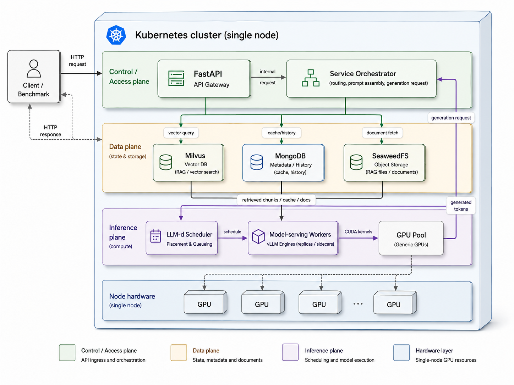

# Where Does the Compute Go?
### A CPU-Centric Characterization of an End-to-End GenAI System

This repository is the artifact for a master's thesis that asks one question of a real,
production-style GenAI system: **where does the compute actually go — and what is the CPU doing?**

**InferSuite is developed by us**: the service, the deployment, the benchmark suite, the agent
harnesses, and the measurement/plotting tooling are all built in-house for this work.



It contains three things:

1. **The Service** — a deployable RAG + semantic-cache + vLLM chatbot on Kubernetes.
2. **The Benchmark Suite** — a load generator + CPU/GPU profiler that measures that service.
3. **The Agentic Workloads** — three agents (SWE-agent, BigCodeBench, OpenClaw) profiled the same way.

**The central question:** what does the CPU do **DURING inference** (the vLLM serving engine) versus
**OUTSIDE inference** (retrieval, cache lookup, tool execution), measured on two axes — wall-clock time
and CPU core-seconds — with the GPU profiled in lockstep (Nsight Compute top-down).

## Measurement setups

| setup | hardware | what was measured there |
|---|---|---|
| Local workstation | Xeon w5-3425 (bare metal, full TMA) + RTX A2000 | agent tool-exec CPU + TMA; during-inference CPU + TMA; phantom-CPU experiment; GPU top-down (7B); full service under k3s (`local_service/`) |
| Cloud cluster (EKS) | `c7i.metal` CPU node (full TMA) + H100 GPU node (no PMU) | deployed-service benchmark: latency, time split, outside-inference pod CPU + TMA |
| Cloud H100 node | H100 PCIe + Xeon 8480+ (KVM guest, no TMA) | self-hosted 32B agents + single-node service, during- and outside-inference CPU; GPU top-down (32B) |

## Repository map

```
src/service/            FastAPI orchestrator: semantic cache, RAG, embeddings, observability
deploy/                 Kubernetes manifests, Helm charts, Kustomize overlays
scripts/                Deploy, ingest, benchmark, and report scripts

benchmark_results/      service benchmark data (tok64/tok192/tok320)
thesis_plots/           service-level figures        inf_thesis_plots/ (+gpu/)  local CPU-TMA + GPU top-downs
h100/  (+service/)      self-hosted 32B campaign: agents + single-node service + 32B GPU top-down
local_service/          local k3s service run: per-tier TMA L1+L2, attribution, 12-cell timing grid

agentic/
  CANONICAL/            single source of truth for the 3 agent benchmarks (microarch.py, data)
  common/               shared perf harness      thesis_figures/  cross-workload figures
  swe_agent/  bigcodebench/  openclaw/            the three workloads
  inference/            phantom-CPU experiment (cudasync/) + GPU-TMA build
```

Large re-creatable artifacts (venvs, model weights, upstream clones, scratch outputs) are gitignored.

## Part I — The Service

FastAPI orchestrator → semantic cache (BGE embed → Milvus → MongoDB) → RAG retrieval
(BGE embed → Milvus → SeaweedFS) → llm-d gateway → vLLM. Embedding model is `bge-base-en-v1.5`
on the CPU; the generation model is configurable via `deploy/config.env` (runs in this work used
Qwen2.5 7B-AWQ, 14B, and 32B). All inter-service traffic is in-cluster.

Deploying is two scripts driven by one config file:

```bash
cp deploy/config.env.example deploy/config.env   # target cluster, registry, model
./setup.sh && ./deploy.sh
python3 scripts/chat_cli.py --show-debug
```

Targets: a managed cloud cluster (CPU node + GPU node) or a single machine (k3s / minikube).
Storage and FastAPI are Kustomize bases with a small cloud overlay; llm-d/vLLM Helm charts are
vendored in `deploy/llmd-local/`. Only the FastAPI image is built here (`Dockerfile.service`).

## Part II — The Benchmark Suite

| path | dataset | isolates |
|---|---|---|
| RAG-standard | open_ragbench | full pipeline (retrieve + generate) |
| RAG pure-fetch | bare questions | retrieval cost alone |
| Semantic-cache | QQP pairs | cache embed + lookup |
| LLM-direct | ShareGPT52K | generation alone |

Inputs come in four size buckets (short → very long); output length is fixed to three tiers
(`tok64/tok192/tok320`) with exact output-token forcing (`ignore_eos` + `min_tokens`), so generation
cost is comparable across paths, buckets, and runs.

## Part III — The Agentic Workloads

Three agents spanning a tool-execution spectrum, with the CPU character set by the **tool payload**
(measured, `agentic/CANONICAL/` + `h100/`):

| workload | what it is | measured tool-exec CPU |
|---|---|---|
| SWE-agent | SWE-bench repo bug-fixing | spans the spectrum per task: compiler-heavy (astropy, 59% cc1), AVX-512 BLAS (scikit-learn, ~89% vectorized), scalar CPython (sympy, ~0% FP) |
| BigCodeBench | generate → run tests → fix loop | real scalar/partly-vector FP from numeric Python (IPC ~0.9, ~24% AVX) |
| OpenClaw | live browser/computer-use tasks | agent-runtime dominated (80–84% Node.js/V8), near-zero FP |

## Part IV — Measurement methodology

- **CPU, whole-pod cgroup scoping** (`perf --for-each-cgroup` / `-G`): the API process alone reads
  ~idle while `VLLM::EngineCore` does the work — process-scoped profiling undercounts serving CPU.
- **Two CPU lenses**: full Intel TMA (L1 + td2 L2) where the PMU allows it (bare metal); a portable
  counter suite (IPC, cache hits, MPKI, AMAT, MLP, ILP, vec-FP%, FLOPs — `agentic/CANONICAL/microarch.py`)
  on virtualized hosts without top-down slots. Software attribution via `perf record -e task-clock`.
- **GPU, Nsight Compute**: Speed-of-Light + two warp-scheduler top-downs (native warp-state and an
  Intel-style Retiring/Frontend/Backend re-binning). Prefill must be profiled with
  `enable_prefix_caching=False` and a distinct warmup, or the "prefill" is a one-token cache hit.

## Key findings

- **The phantom CPU.** During inference the engine host thread busy-waits on CUDA event
  synchronization — it looks healthy (IPC 3.2–3.7, retiring-bound, L1-resident) while doing no work.
  App-invariant (65–96% of engine CPU across code-gen, code-repair, computer-use, and the service)
  and load-induced (~2 cores under load vs ~0.02 idle), reproduced on three machines and two model scales.
- **Reclaimable, version-permitting.** A blocking-sync `LD_PRELOAD` shim recovers ~76% of the engine
  core at no throughput cost on vLLM 0.23; vLLM 0.24's synchronization path is not intercepted by it.
- **The real CPU work lives outside inference**, and its character is set by the payload: compiler,
  BLAS, interpreter, agent runtime, or the AVX-512 embedding GEMM — not by "it's an agent/service".
- **Two independent axes.** Output tier sets GPU time (~linear in tokens); input bucket sets CPU-side
  time (query-embedding-driven). Agent loops are inference-dominated except when the tool payload is
  numeric (scikit-learn flips the loop to ~71% CPU).
- **The serial alternation.** GPU-busy/CPU-idle during generation, CPU-busy/GPU-idle during tools;
  measured negatives (co-compute 1.05×, CPU draft 37<45 tok/s) bound the CPU to control, not compute.

## Reproducing

Service: deploy (Part I) → `scripts/run_benchmark.sh` → `scripts/generate_report.py`.
Local k3s service run: `local_service/scripts/` (setup → deploy → capture → plots).
Agentic: `run_*.sh` under `agentic/{swe_agent,bigcodebench,openclaw}/`; shared harness in `agentic/common/`.
Collection and plotting are separate; figures regenerate from collected data with system `python3`.
