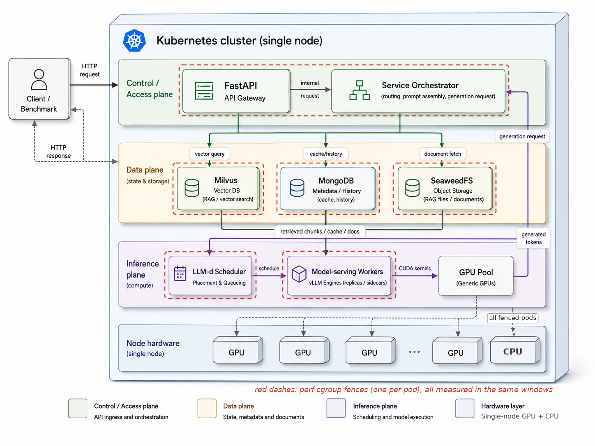

# Where Does the Time Go?
### An end-to-end GenAI system and the benchmark suite that measures it

InferSuite is a deployable RAG + semantic-cache + vLLM service, a load generator that drives it,
and a CPU/GPU profiling harness that attributes where the time and compute go — **during inference**
(the serving engine) versus **outside inference** (retrieval, cache lookup, agent tool execution) —
in wall-clock time and CPU core-seconds, with the GPU profiled in lockstep (Nsight Compute).

**InferSuite is developed by us**: the service, the deployment, the benchmark suite, the agent
harnesses, and the measurement/plotting tooling are all built in-house for this work.



It contains three things:

1. **The Service** — a deployable RAG + semantic-cache + vLLM chatbot on Kubernetes.
2. **The Benchmark Suite** — a load generator + CPU/GPU profiler that measures that service.
3. **The Agentic Workloads** — three agent benchmarks, profiled the same way: SWE-agent on SWE-bench, our own driver on BigCodeBench, and OpenClaw on WildClawBench.

## Running the measurements — one command

Every measurement campaign runs through a single entry point, `./measure.sh`, which dispatches
to the proven per-campaign kits (it sets the right data root / env; nothing is reimplemented):

```bash
./measure.sh agents-swe preflight            # env checks, no spend
./measure.sh agents-swe campaign             # SWE-agent x GLM-5.2 (SWE_long)
./measure.sh agents-oc  campaign             # OpenClaw x GLM-5.2 (OC_long)
./measure.sh service    campaign             # local k3s service, per-tier CPU/TMA
./measure.sh plots                           # regenerate every figure set (no spend)
./measure.sh validate                        # run every validator over banked data
```

Per-campaign knobs are env vars with certified defaults (e.g. `SWE_INSTANCES=…`,
`OC_TASKS=…`, `SWE_DRAIN_S=…`); `./measure.sh help` lists them. Stages are shared across
campaigns: `preflight → dryrun → smoke → campaign → validate`.

## Repository map

```
measure.sh              ONE-COMMAND entry to every measurement campaign (dispatches to the kits)
src/service/            FastAPI orchestrator: semantic cache, RAG, embeddings, observability
deploy/                 Kubernetes manifests, Helm charts, Kustomize overlays
scripts/                Deploy, ingest, benchmark, and report scripts

plots/                  curated figure gallery: domain -> setup -> tier/bench (see plots/README.md)
results/                curated data gallery, same structure, symlinks into the real data dirs

# THESIS SCOPE (2026-07-12): the thesis shows two isolated campaigns only —
#   the local isolated service (local_service/data_iso) and the GLM-5.2 isolated
#   agent runs (local_agents/{SWE_long,OC_long}). The H100 campaign and the EKS
#   service benchmark were moved to archive/ (see archive/README.md).

local_service/          local k3s service run: per-tier TMA L1+L2, attribution, 12-cell timing grid
  scripts/iso/          isolated-campaign kit: run_service_campaign.sh, validate, plot
  data_iso/  plots_iso/ banked 36-cell data + figures

local_agents/           local agent campaigns (GLM-5.2 frontier tier)
  scripts/glm/          campaign kit: run_glm_campaign.sh (SWE + OC), lineage watcher, validate, plotters
  SWE_long/             long-horizon SWE-agent: data/ plots/ plot_spec.json LAUNCH.md
  OC_long/              long-horizon OpenClaw:  data/ plots/ plot_spec.json (lineage-fenced)

agentic/
  CANONICAL/            single source of truth for the 3 agent benchmarks (microarch.py, data)
  common/               shared perf harness      thesis_figures/  cross-workload figures
  swe_agent/  bigcodebench/  openclaw/            the three workloads
  inference/            phantom-CPU experiment (cudasync/) + GPU-TMA build + during-inference figures (plots/)

archive/                regenerable run artifacts moved out of the tree (old logs, dup eval reports)
```

Large re-creatable artifacts (venvs, model weights, upstream clones, scratch outputs) are gitignored.

## Part I — The Service

FastAPI orchestrator → semantic cache (BGE embed → Milvus → MongoDB) → RAG retrieval
(BGE embed → Milvus → SeaweedFS) → llm-d gateway → vLLM. The embedding model is `bge-base-en-v1.5`
on the CPU; the generation model is configurable. All inter-service traffic is in-cluster.

Deploying is two scripts driven by one config file:

```bash
cp deploy/config.env.example deploy/config.env   # target cluster, registry, model
./setup.sh && ./deploy.sh
python3 scripts/chat_cli.py --show-debug
```

Targets: a managed cloud cluster (CPU node + GPU node) or a single machine (k3s / minikube).
Storage and FastAPI are Kustomize bases with a small cloud overlay; llm-d/vLLM Helm charts are
vendored in `deploy/llmd-local/`. Only the FastAPI image is built here (`Dockerfile.service`).

### Configuration — one file: `deploy/config.env`

Copy `deploy/config.env.example` → `deploy/config.env` and edit. The knobs you'll touch most:

**Model / serving**
| variable | example | controls |
|---|---|---|
| `MODEL_NAME` | `qwen2.5-14b` | service-facing model id (change together with the repo below) |
| `MODEL_HF_REPO` | `Qwen/Qwen2.5-14B-Instruct` | HuggingFace repo downloaded to the model volume |
| `MODEL_MAX_LEN` | `32768` | max context length |
| `MODEL_GPU_MEM_UTIL` | `0.90` | vLLM GPU-memory fraction |
| `MODEL_STORAGE_GI` | `40` | model-weights volume size, Gi |
| `MODEL_REPLICAS` | `1` | number of vLLM decode workers (one GPU node each) |
| `GPU_COUNT` | `1` | GPUs per replica → vLLM `--tensor-parallel-size` |

**Cluster**
| variable | example | controls |
|---|---|---|
| `DEPLOY_ENV` | `eks` | deploy target (cloud cluster or `minikube`) |
| `NAMESPACE_SERVICE` | `llm-service` | FastAPI + storage namespace |
| `NAMESPACE_LLMD` | `llm-d` | vLLM + gateway namespace |

Cloud-target details (registry, region, node machine types) live alongside these in
`config.env.example`. To switch model or tensor-parallelism, edit the model rows and re-run
`./deploy.sh`; for new RAG documents, add PDFs and run `FORCE_REINGEST=1 ./deploy.sh`.

## Part II — The Benchmark Suite

| path | dataset | isolates |
|---|---|---|
| RAG-standard | open_ragbench | full pipeline (retrieve + generate) |
| RAG pure-fetch | bare questions | retrieval cost alone |
| Semantic-cache | QQP pairs | cache embed + lookup |
| LLM-direct | ShareGPT52K | generation alone |

Inputs come in four size buckets (short → very long); output length is fixed to three tiers
(`tok64/tok192/tok320`) with exact output-token forcing (`ignore_eos` + `min_tokens`), so generation
cost is comparable across paths, buckets, and runs.

## Part III — The Agentic Workloads

Three agents chosen to span different kinds of tool-execution work:

| workload | what it is | tool-execution work |
|---|---|---|
| SWE-agent (`swe_agent/`) | SWE-bench repo bug-fixing, external SWE-agent harness | repo navigation, edits, builds, test suites |
| BigCodeBench (`bigcodebench/`) | own driver: generate → run tests → fix loop | executing numeric/library Python every turn |
| OpenClaw (`openclaw/`) | WildClawBench live browser / computer-use tasks | browser control, documents, images |

Shared measurement harness in `agentic/common/`; corrected canonical data and derivations in
`agentic/CANONICAL/` (`microarch.py` is the single source of truth for derived metrics).

## Part IV — Measurement methodology

- **CPU, whole-pod cgroup scoping** (`perf --for-each-cgroup` / `-G`): the API process alone reads
  ~idle while `VLLM::EngineCore` does the work — process-scoped profiling undercounts serving CPU.
- **Two CPU lenses**: full Intel TMA (L1 + td2 L2) where the PMU allows it (bare metal); a portable
  counter suite (IPC, cache hits, MPKI, AMAT, MLP, ILP, vec-FP%, FLOPs) on virtualized hosts without
  top-down slots. Software attribution via `perf record -e task-clock` (no PMC contention).
- **GPU, Nsight Compute**: Speed-of-Light + two warp-scheduler top-downs (native warp-state and an
  Intel-style Retiring/Frontend/Backend re-binning). Prefill must be profiled with
  `enable_prefix_caching=False` and a distinct warmup, or the "prefill" is a one-token cache hit.

## Reproducing

Service: deploy (Part I) → `scripts/run_benchmark.sh` → `scripts/generate_report.py`.
Local k3s service run: `local_service/scripts/` (setup → deploy → capture → plots).
Agentic: `run_*.sh` under `agentic/{swe_agent,bigcodebench,openclaw}/`; shared harness in `agentic/common/`.
Collection and plotting are separate; figures regenerate from collected data with system `python3`.
